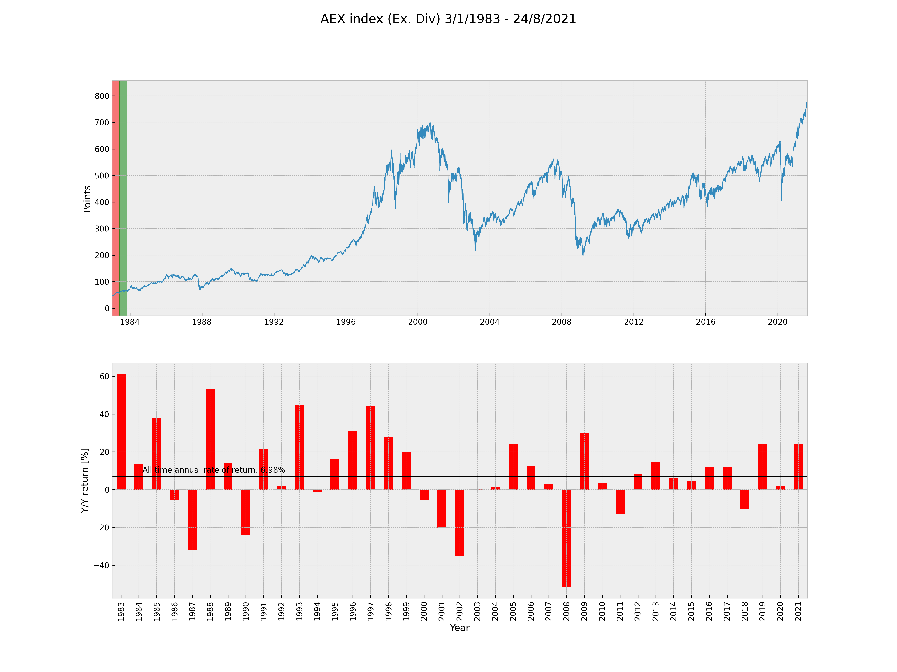

# aex-all-time-graph

AEX index started on the 4th of March 1983 (04/03/1983) containing the 25 largest, by market capitalization, traded companies on the Amsterdam stock exchange. 

Data: 
https://stooq.com
https://stooq.com/q/d/?s=%5Eaex&c=0

Data till 24/8/2021

